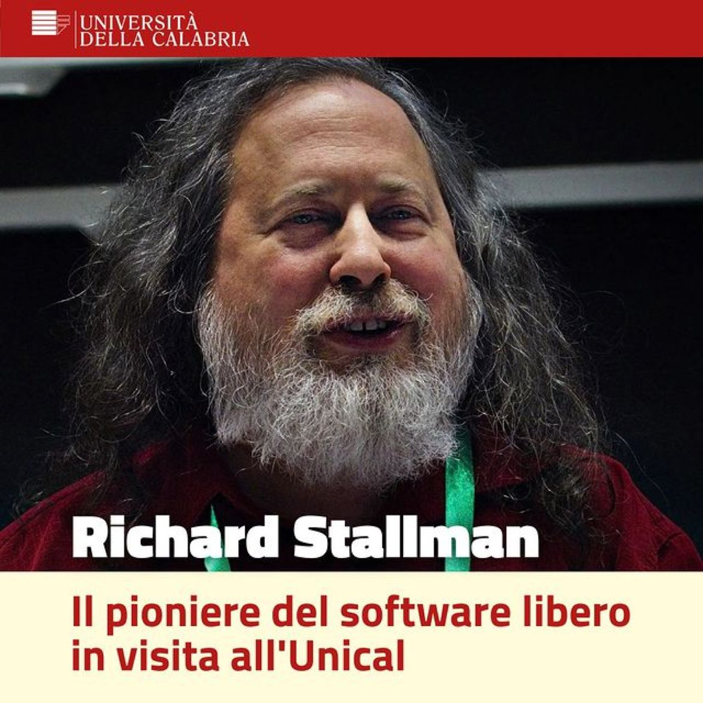
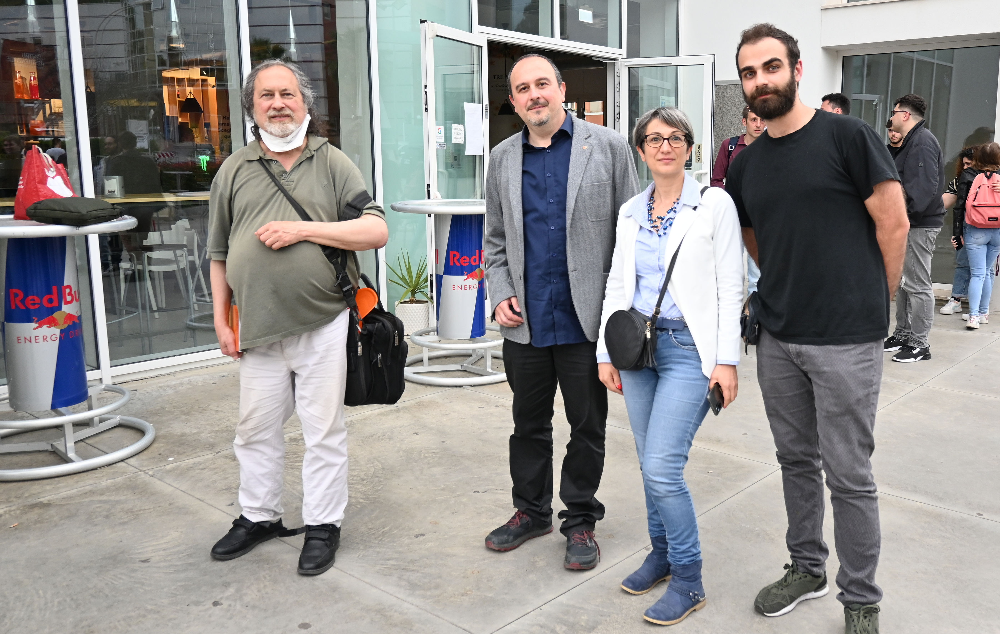
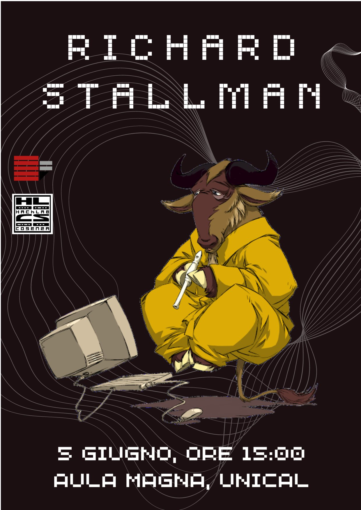
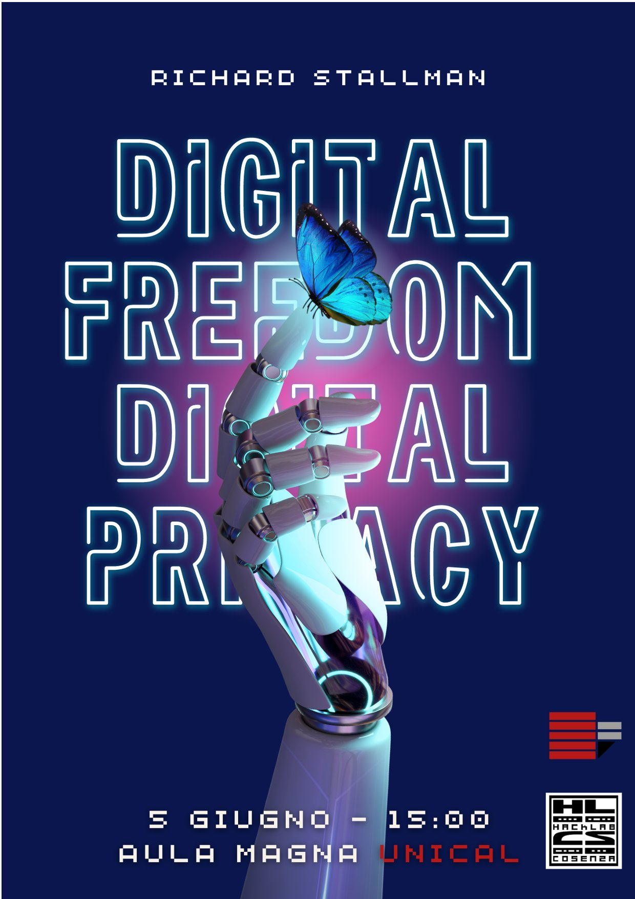

### A dream made possible by the University Della Calabria UNICAL

I am excited to share a recap of the extraordinary event "A Free Digital Society" featuring the legendary Richard Stallman, held at the University of Calabria. Richard Stallman, also known as RMS, is a pioneer of the free software movement and the founder of the Free Software Foundation (FSF). His vision for a digital era free from the restrictions of proprietary software has inspired thousands of programmers and activists worldwide. During the event, Stallman delivered a passionate lecture on the importance of digital freedoms and the crucial role of free software. He discussed the ethical and social implications of using proprietary software and shared his vision for a future where users have complete control over their devices and data.



<sub> *Official poster of the University of Calabria; "Free software pioneer visiting Unical"* </sub>

I want to give a special thanks to Professor Greco, Professor Ianni, and Dr. Russo for their incredible support and assistance in organizing this event. Without their dedication and commitment, this initiative would not have been possible. Their support made it possible to realize one of my greatest dreams: meeting and listening to the last true Hacker in history, Richard Stallman. Additionally, I express my deep gratitude to the University of Calabria for hosting us and providing a stimulating and welcoming environment for this event. The university's support was fundamental to the success of "A Free Digital Society."



<sub> *From left: Richard Stallman; Prof. Ianni Gb.; Dr. Russo; Me:* </sub>

Meeting Richard Stallman was a unique opportunity for all participants to immerse themselves in the world of free software and understand the importance of digital freedom. I hope this event has inspired many of you to join the cause of free software and contribute to a more just and free digital future. Thank you to everyone who participated and made this unforgettable event possible. Stay tuned for more initiatives as we continue to explore the world of free software together!

---

### My Speech

```
Good afternoon, everyone, and thank you for coming.

I apologize in advance for my bad pronunciation.

When I started telling my colleagues and friends that Richard Stallman
would be coming to the university, the general response was always,
"How did you manage to make that happen?" And the truth is, it went
something like this... Some time ago, I sent an email to Richard,
expressing my strong desire to meet him and see him in person, even
just for a coffee. A few days later, he replied, "Okay, let's meet." At that
precise moment, I could no longer believe what I was reading. Richard
Stallman, the Hacker who becomes emotional when speaking about the
old AI laboratory at MIT, the Hacker who created the GNU system, the
Hacker who decided to develop an entire operating system and various
applications for the ideal of freedom, the Hacker who has been a part of
the computer revolution through the Free Software Foundation, GNOME,
Emacs, and more... had responded to my email. Try to imagine my
reaction: That was my first moment of ecstasy.

So thank you Richard for coming.

The second mission was to find someone within the UNICAL department
who could assist a student like me (even though I didn't have
outstanding grades, so not exactly a model student) in granting my wish
to invite Stallman. The first person who came to mind was my thesis
advisor, Professor Ianni, who has shown a high level of patience with
students over the years. The conversation went something like this...
"Prof, would it be possible to host Richard Stallman at the university?"
and he replied more or less like this, "Let's see what we can do." He took
it upon himself, and after some time, he informed me that the
department would be able to accommodate him. That was my second
moment of ecstasy.

Professor Ianni, thank you for all you have done.

Keep in mind that I have never invited anyone before, nor have I ever
organized such an important event in my life, and I immediately made it
clear to Professor Ianni. His response was that he would seek help from
the Hacklab in Cosenza for logistical and organizational support. We
attended a meeting together, and the Hacklab also offered to assist us in
organizing. When I think about everything they did, I get anxious just
thinking that I should have done it. Truly, congratulations to them. I'm not
a gambler, but with all this luck, between Stallman, Ianni, and Hacklab, I
probably would have won some bets. Too bad I didn't make any...

However, these three components, so Stallman, Ianni and Hacklab, have
changed me a bit. In them, I see informality, anti-bureaucracy,
open-mindedness, and the fight for ideals. Their ethics can be compared
to the Hacker ethic, As described in Steven Levy's book "Hackers, the
Heroes of the Computer Revolution" which was given to me by Ciccillo,
another hacker who changed my life.

Let's stop associating the word "Hacker" with computer criminals!
According to the original hacker culture, as described in works like
Steven Levy's book, hackers were considered true "heroes" of the
computer revolution, not criminals. Hackers have always fought to
enable access to information, breaking down barriers of economics and
society. And yet, some still label them as criminals? Hackers exist
without skin color, without nationality, without religious prejudices, with
the primary goal of sharing their experiences and knowledge with the
hacker community. And yet, some still associate them with criminals? If
hackers were criminals, their crime would be curiosity. Their crime would
be judging people based on what they say and think, not their
appearance or title. And that's exactly what was happening in the AI
laboratory at MIT, where extraordinary people like Stallman made
history.

I apologize for the clarification, but I felt it was important.

In conclusion, I sincerely want to thank the availability and participation
offered by Professor Greco in organizing this event, the magnificent
Rector Leone for granting us this wonderful auditorium, and all the
participants in the event, because it is thanks to them that this day was
made possible. Ah I almost forgot the big thank you to Dr. Russo for her
wonderful welcome, helpfulness and patience.

I am honored to leave the floor to Richard Stallman, The Last True
Hacker.

Happy Hacking.
```

---

### Propaganda



